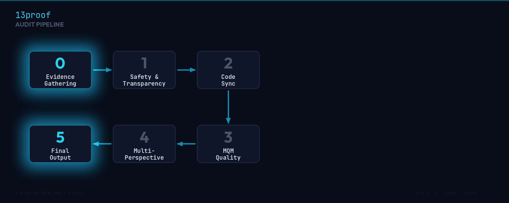

```
     ██╗██████╗ ██████╗ ██████╗  ██████╗  ██████╗ ███████╗
    ███║╚════██╗██╔══██╗██╔══██╗██╔═══██╗██╔═══██╗██╔════╝
    ╚██║ █████╔╝██████╔╝██████╔╝██║   ██║██║   ██║█████╗  
     ██║ ╚═══██╗██╔═══╝ ██╔══██╗██║   ██║██║   ██║██╔══╝  
     ██║██████╔╝██║     ██║  ██║╚██████╔╝╚██████╔╝██║     
     ╚═╝╚═════╝ ╚═╝     ╚═╝  ╚═╝ ╚═════╝  ╚═════╝ ╚═╝     
            6-stage document audit  ·  AI-powered
```

[](LICENSE)
[](#installation)
[](.github/workflows/13proof.yml)

A 6-stage document quality audit powered by AI. Works with **Claude Code** and **Gemini CLI**.

Analyzes technical documentation for accuracy, security issues, code synchronization, terminology consistency, and style. Produces traceable corrections and audit reports in Markdown, JSON, and interactive HTML.

---

## Quick Start

```bash
# As a Claude Code plugin
claude plugin install 13proof

# Then, inside any Claude Code session:
/13proof README.md

# Or standalone:
git clone https://github.com/SOsintOps/13proof.git
./13proof.sh docs/README.md
```

---

## Table of Contents

- [How It Works](#how-it-works)
- [The 6-Stage Pipeline](#the-6-stage-pipeline)
- [Installation](#installation)
- [Usage](#usage)
- [Configuration](#configuration)
- [CI/CD Integration](#cicd-integration)
- [Output Examples](#output-examples)
- [FAQ](#faq)
- [Repository Structure](#repository-structure)
- [Contributing](#contributing)
- [License](#license)

---

## How It Works

Most document review tools check spelling and grammar. 13proof goes deeper: it treats documentation as a critical part of the codebase and audits it with the same rigor you'd apply to a code review.

The tool sends your document through a 6-stage pipeline where an AI model acts as three different expert reviewers (architect, technical writer, compliance officer) who must reach consensus before flagging an issue. This eliminates false positives and ensures every finding is meaningful.

### Design Principles

- **Traceability** — every correction links back to a specific line and reason. No unexplained changes.
- **Consensus over noise** — findings go through a multi-perspective review. Only issues confirmed by at least 2 out of 3 simulated reviewers make it to the final report. This dramatically reduces false positives.
- **Code-aware** — the tool doesn't just check prose. It validates code blocks against your actual source files, catches outdated APIs, and flags broken examples.
- **Engine-agnostic** — the same pipeline runs on Claude Code or Gemini CLI. You choose the AI that works for your team.
- **Zero lock-in** — it's a set of Markdown instructions and a bash script. No proprietary runtime, no SaaS dependency, no build step. Fork it, modify it, use it however you want.

---

## The 6-Stage Pipeline



**Stage 0 — Evidence Gathering.**
The AI reads the document and builds an internal map: headings, sections, terminology, code blocks, references to external files. This map becomes the source of truth for all subsequent stages. Every finding must cite a specific line or section.

**Stage 1 — Safety and Transparency.**
Checks for exposed secrets (API keys, tokens, passwords, private paths), AI disclosure where applicable, and bias in technical examples. Issues are classified as Critical, Major, or Minor.

**Stage 2 — Code Synchronization.**
For each code block, validates syntax against the declared language and cross-references claims against actual source files in the project. Flags obsolete code, missing imports, and changed APIs.

**Stage 3 — Quality Audit (MQM).**
Analytical evaluation across five dimensions: accuracy, fluency, terminology, style, and completeness. Each error is categorized and assigned a severity level.

**Stage 4 — Multi-Perspective Review.**
All Critical and Major findings are debated from three viewpoints: Senior Architect (technical correctness), Technical Writer (clarity for target audience), and Compliance Reviewer (security, privacy, licensing). Only findings confirmed by at least 2 of 3 perspectives survive.

**Stage 5 — Final Output.**
Produces corrected documents and audit reports in your chosen formats: Markdown, JSON, and/or interactive HTML dashboard.

---

## Installation

### As a Claude Code plugin

```bash
claude plugin install 13proof
```

This adds `/13proof` and `/13proof-batch` as slash commands in your Claude Code sessions.

### Manual (clone and use)

```bash
git clone https://github.com/SOsintOps/13proof.git
cd 13proof
chmod +x 13proof.sh
```

Then either copy the `.claude/` directory into your project, or use the standalone script directly.

### Requirements

| Mode | What you need |
|------|---------------|
| Plugin (Claude Code) | [Claude Code](https://docs.claude.com/en/docs/claude-code) installed |
| Plugin (Gemini) | [Gemini CLI](https://github.com/google-gemini/gemini-cli) installed |
| Standalone script | Bash 4+ and either `claude` or `gemini` CLI |
| CI/CD | An API key (see [CI/CD Integration](#cicd-integration)) |

> **No API key is needed for local use.** When you run the plugin inside Claude Code or Gemini CLI, your existing login session handles authentication.

---

## Usage

### Slash commands (inside Claude Code)

```
/13proof README.md
/13proof docs/api-reference.md
/13proof-batch docs/
```

### Standalone script

```bash
# Auto-detects which AI CLI you have installed
./13proof.sh docs/README.md

# Specify engine explicitly
./13proof.sh docs/README.md --engine claude
./13proof.sh docs/README.md --engine gemini

# Choose model and output format
./13proof.sh docs/API.md --engine claude --model claude-sonnet-4-6
./13proof.sh docs/API.md --engine gemini --model gemini-2.5-pro

# Generate all report formats
./13proof.sh docs/API.md --format all --output ./reports
```

### Flags

| Flag | Description | Default |
|------|-------------|---------|
| `--engine` | AI engine: `claude` or `gemini` | auto-detect |
| `--model` | Specific model ID | engine default |
| `--output` | Output directory | same as source |
| `--format` | Report format: `md`, `json`, `html`, `all` | `md` |
| `--help` | Show help | — |
| `--version` | Show version | — |

---

## Configuration

Create `.proofreadrc.yaml` in your project root for per-project settings, or `~/.proofreadrc.yaml` for global defaults.

```yaml
engine: auto                # auto, claude, gemini
language: auto              # auto-detect, or force: it, en, de, fr...
severity_threshold: all     # all, minor, major, critical

output_formats:
  - markdown
  - json
  - html

ci_fail_threshold: 70       # score below this fails CI (0 = never fail)
generate_corrected: true    # produce [name]_proofread.[ext]

stages:
  safety:
    check_secrets: true
    check_ai_disclosure: false
  code_sync:
    validate_syntax: true
    cross_reference: true
  multi_perspective:
    consensus_threshold: 2  # N out of 3 must agree
```

A complete example with all options is in [`examples/.proofreadrc.yaml`](examples/.proofreadrc.yaml).

---

## CI/CD Integration

The included GitHub Action runs 13proof automatically on PRs that modify documentation files (`.md`, `.txt`, `.rst`). It posts audit results as a PR comment and optionally fails the check if any file scores below your threshold.

### Setup

1. Add your API key to the repository: **Settings > Secrets and variables > Actions**
   - For Claude: create `ANTHROPIC_API_KEY`
   - For Gemini: create `GEMINI_API_KEY`
2. Copy `.github/workflows/13proof.yml` to your repository
3. Done — the workflow triggers automatically on PRs

> **Why does CI/CD need an API key?** In CI/CD there is no logged-in user. The GitHub Actions runner must call the AI API directly, which requires authentication. This is the _only_ scenario where a key is needed.

You can also trigger audits manually from the **Actions** tab with custom parameters: specific files, engine choice, model, and quality threshold.

---

## Output Examples

For a file `docs/guide.md`, 13proof generates:

| File | Format | Purpose |
|------|--------|---------|
| `guide_proofread.md` | Markdown | Corrected document with change comments |
| `guide_audit_report.md` | Markdown | Human-readable audit report |
| `guide_audit_report.json` | JSON | Machine-readable for CI/CD threshold checks |
| `guide_audit_report.html` | HTML | Interactive dashboard: score gauge, sortable findings, category breakdown |

---

## FAQ

<details>
<summary><strong>Do I need an API key?</strong></summary>

No, not for local use. When you use the plugin inside Claude Code or Gemini CLI, your existing login handles authentication. An API key is only needed for CI/CD (GitHub Actions), because there is no logged-in user on the runner.
</details>

<details>
<summary><strong>Which AI models are supported?</strong></summary>

Any model available through Claude Code or Gemini CLI. Defaults: `claude-opus-4-6` for Claude, `gemini-2.5-pro` for Gemini. Override with `--model` or in `.proofreadrc.yaml`.
</details>

<details>
<summary><strong>Can I use both Claude and Gemini in the same project?</strong></summary>

Yes. The `--engine` flag or the `engine` field in `.proofreadrc.yaml` lets you switch freely. The pipeline is engine-agnostic — it's a structured prompt, not tied to any specific API.
</details>

<details>
<summary><strong>How does the multi-perspective review work?</strong></summary>

In Stage 4, the AI simulates three expert viewpoints: Senior Architect (technical correctness), Technical Writer (clarity), and Compliance Reviewer (security and licensing). A finding only reaches the final report if at least 2 of 3 perspectives agree it's a real issue. This consensus mechanism significantly reduces false positives.
</details>

<details>
<summary><strong>What is the quality score?</strong></summary>

A number from 0 to 100 reflecting overall document quality across all MQM categories. Critical findings heavily penalize the score, Major moderately, Minor slightly. A score above 80 generally indicates good documentation. The threshold is configurable for CI/CD.
</details>

<details>
<summary><strong>Does it modify my files?</strong></summary>

Only if you want it to. The corrected document is saved as a separate file (`_proofread` suffix), never overwriting the original. You review the changes and decide what to keep.
</details>

<details>
<summary><strong>Can I customize which checks run?</strong></summary>

Yes. In `.proofreadrc.yaml` you can disable specific MQM categories, skip AI disclosure checks, turn off code cross-referencing, and more. See [Configuration](#configuration).
</details>

<details>
<summary><strong>What languages does it support?</strong></summary>

The tool auto-detects the document language and writes the report in the same language. Force a specific language with `language: it` (or `en`, `de`, `fr`, etc.) in the config.
</details>

<details>
<summary><strong>How long does an audit take?</strong></summary>

Depends on document length and model. A typical README: 30-60 seconds. Long documents (50+ pages): several minutes. Progress is shown in real-time.
</details>

---

## Repository Structure

```
13proof/
├── .claude/
│   ├── commands/
│   │   ├── 13proof.md              # /13proof slash command
│   │   └── 13proof-batch.md        # /13proof-batch batch mode
│   └── skills/
│       └── proofread/
│           └── SKILL.md            # Full 6-stage pipeline instructions
├── .github/
│   └── workflows/
│       └── 13proof.yml             # GitHub Action for CI/CD
├── templates/
│   ├── audit_report.md.tmpl        # Markdown report template
│   ├── audit_report.json.tmpl      # JSON report template
│   └── audit_report.html.tmpl      # HTML dashboard template
├── examples/
│   └── .proofreadrc.yaml           # Example configuration
├── 13proof.sh                      # Standalone script (Claude + Gemini)
├── plugin.json                     # Claude Code plugin manifest
├── .proofreadrc.yaml               # Default configuration
├── LICENSE                         # MIT
└── README.md
```

---

## Contributing

Contributions are welcome. To get started:

1. Fork the repository
2. Create a feature branch: `git checkout -b feature/my-improvement`
3. Make your changes
4. Test with `./13proof.sh README.md` (meta-audit the README itself)
5. Submit a pull request

When contributing, please keep the pipeline engine-agnostic. Changes to `SKILL.md` should work with both Claude and Gemini.

---

## License

This project is licensed under the [MIT License](LICENSE).
